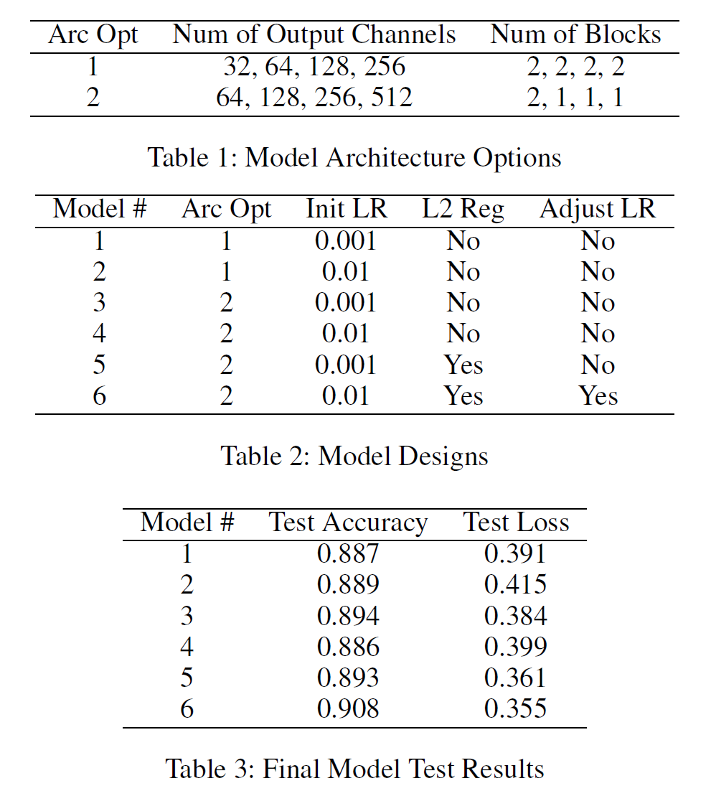

# Deep Learning Mini Project

## Introduction
This is the mini project of CS-GY 6953 deep learning course. 

Through experiments with six different models, we explore the impact of the choice of learning rate and the use of L2 
regularization on model performance; and we propose a final modified residual network (ResNet) architecture with less 
than 5 million trainable parameters that achieves a test accuracy of over 90% on CIFAR-10 image classification dataset.

ResNet-18 has four residual layers, each of which has two residual blocks. The number of output channels in the four 
layers are 64, 128, 256 and 512 respectively. While a properly trained ResNet-18 model can achieve test accuracy of 
over 95% on CIFAR-10 image classification datase, it has more than 11 million trainable parameters and takes a 
significant amount of time to train. We aim to come up with a ResNet architecture with less than 5 million trainable 
parameters and achieves an accuracy reasonably comparable with the ResNet-18 architecture.

## Experiment Ideas
To reduce number of parameters, we experimented with two ideas:
* Reduce the number of output channels in the four layers to 32, 64, 128, and 256, and keep the number of blocks in 
each layer unchanged. This gives a reduced number of parameters of 2,797,610.
* Keep the number of output channels in the four layers unchanged from ResNet 18, and reduce the number of blocks in 
the last three layer from 2 to 1. This gives a reduced number of parameters of 4,977,226.

To boost accuracy, we experimented with the following ideas:
* Use different learning rate
* Use L2 Regularization
* Tune model with learning rate scheduler

## Model Designs
We experimented with two architecture as summarized in Table 1 and six models in total as summarized in Table 2. All of 
the six models have four residual layers as the original ResNet-18 architecture.
* Both model 1 and model 2 uses Architecture Option 1 and have 2,797,610 trainable parameters. Their difference lies in 
the learning rate. We use the learning rate of 0.001 and 0.01 respectively for the two models. Both models were trained 
for 100 epochs. Both model 3 and model 4 uses Architecture Option 2 and have 4,977,226 trainable parameters. Their 
difference also lies in the learning rate. Both models were trained for 100 epochs.
* For model 5 and model 6 are improved models on the second architecture option.We used L2 regularization on both model 
5 and model 6. For model 6, we used a decreasing learning rate scheduler.

## Experiment Results
We trained and tested the six models. Here are some comparison plots for the final results.

